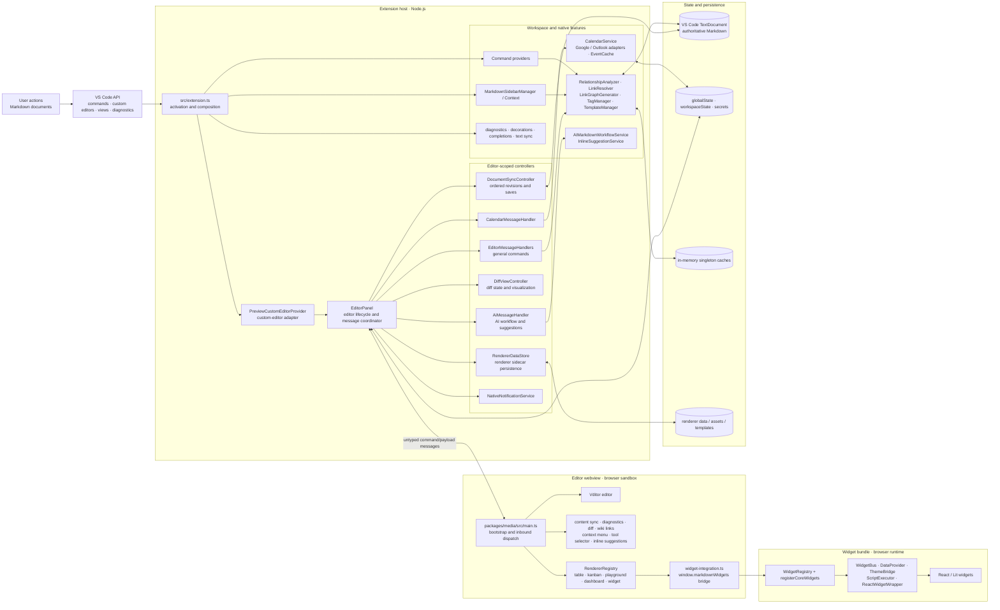
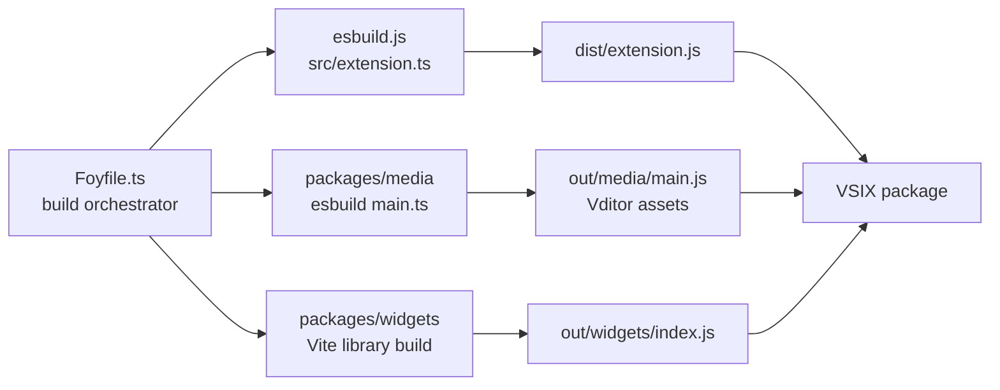

# Current Architecture Review

_Reviewed against the repository on 2026-09-14. This describes the current implementation, not a target architecture._

## Architecture at a glance

The deployment unit is one VS Code extension, but it contains two execution environments: trusted Node.js code in the extension host and browser code in a restricted webview. The webview loads two independently built bundles: the media/editor bundle and the widget bundle. Their most important seam is the bidirectional VS Code webview message channel.

## Build architecture

The root Yarn workspace orchestrates three compilation units. `src/extension.ts` is bundled for Node, `packages/media/src/main.ts` is bundled for the webview, and `packages/widgets` is built as a browser library exposed through `window.markdownWidgets`. `Foyfile.ts` coordinates type checks and builds; it also stages the entire worktree with `git add -A`, an avoidable coupling between compilation and source-control state.

## Module map and seams

| Module | Responsibility and interface | State ownership | Main dependencies |
|---|---|---|---|
| `src/extension.ts` | Activates the extension and registers commands, providers, views, watchers, and services. Its effective interface is VS Code's `activate(context)` lifecycle. | Extension subscriptions plus three process globals. | Nearly every host-side feature module and VS Code. |
| `PreviewCustomEditorProvider` | Adapts VS Code's custom-editor lifecycle to `EditorPanel`. | None beyond `ExtensionContext`. | `EditorPanel`, tab/diff classification, VS Code. |
| `EditorPanel` | Coordinates one editor webview, message routing, document updates, configuration, diagnostics, and editor lifecycle. | Panel/document identity, active-editor registries, readiness, cursor and sync state. | Seven editor-scoped controllers, services, diagnostics, VS Code. |
| Editor-scoped controllers | Hide substantial behavior behind narrow host interfaces (`HandlerHost`, `RendererDataStoreContext`, injected `postMessage`, or an `EditorPanel` host). | Sync queue/revisions, diff state, AI workflow state, renderer persistence behavior. | `EditorPanel` host plus focused services. |
| Workspace services | Resolve links, scan tags, calculate relationships/graphs, manage templates, AI workflows, and calendars. | Mostly process-wide singleton caches; calendar tokens use VS Code secret/global state. | VS Code workspace/file APIs and external calendar/LM APIs. |
| Sidebar and native providers | Present workspace knowledge through tree/webview views, diagnostics, decorations, completions, and commands. | Active-document context and view refresh events. | Workspace services and, in two places, `EditorPanel`. |
| `packages/media` | Boots Vditor and coordinates browser-side editor features. `main.ts` is the inbound message dispatcher. | Shared `webview-state` plus several `window.*` globals. | Vditor, renderer registry, widgets bridge, and two pure helpers imported from `src`. |
| Renderer system | Maps fenced-block languages to renderer implementations through `RendererRegistry` and narrow renderer interfaces. | Registry singleton and renderer-local state. | Vditor, renderer helpers, optional widget runtime. |
| `packages/widgets` | Defines the widget runtime, registry, bus, data sources, wrappers, and concrete widgets. | Registry/bus singletons and widget instances. | React, Lit, browser custom elements. |

The cleanest seams are `DocumentSyncController` (pure interface with injected I/O), the focused diff/AI/calendar controllers, and the renderer/widget registries. These are deep modules: callers know little compared with the behavior hidden behind them, and tests can exercise their interfaces directly. `HandlerHost` and `RendererDataStoreContext` make dependencies explicit, but the modules behind them still expose many unrelated operations and are comparatively shallow.

The weakest seams are the message protocol, process/browser globals, singleton discovery, and direct access to `EditorPanel['_panel']` from `MarkdownSidebarContext`. Those interfaces require callers to know representation details or runtime ordering.

## Runtime communication and state flow

| Flow | Mechanism | Architectural consequence |
|---|---|---|
| VS Code → extension features | Direct calls and VS Code events/disposables | Conventional extension architecture; lifecycle is centralized in `activate`, but construction and behavior registration are mixed. |
| Extension host ↔ editor webview | `postMessage`, `onDidReceiveMessage`, and `window.message` with string commands and mostly `any` payloads | This is the largest public interface and test surface, but it has no single contract. A rename or payload drift can fail only at runtime. |
| Webview feature coordination | Direct imports, DOM events, `webview-state`, and `window.*` properties | Multiple coordination mechanisms make ordering and ownership harder to trace. |
| Editor persistence | Vditor emits full-document revisions → `DocumentSyncController` queues `WorkspaceEdit`s → `TextDocument.save()` | The document is authoritative; the controller is a good deep seam that concentrates ordering rules. |
| Workspace knowledge | File scans and VS Code document/file events update several independent singleton caches | Link resolution, relationships, tags, and graphs can rescan or invalidate independently, so workspace knowledge has fragmented ownership. |
| Widget communication | Global bundle export, registry lookup, custom elements, DOM events, and host messages | Extensible at the registry seam, but the bootstrap relies on script order and ambient global state. |

## Metrics

Scores are qualitative and relative to this repository. Low coupling and high cohesion are desirable; depth describes how much behavior is hidden behind the interface.

| Module | Coupling | Cohesion | Depth | Violations / notes |
|---|---|---|---|---|
| Extension activation | High | Medium | Shallow | Imports 19 internal modules, constructs services, implements commands/watchers, and publishes globals in one function. |
| Custom-editor provider | Low | High | Deep | Clean VS Code adapter; the error-recovery path also creates panels, slightly duplicating lifecycle policy. |
| `EditorPanel` | High | Medium | Medium | 13 internal imports and a very broad message/lifecycle interface; improved by prior controller extractions but still the central dependency hub. |
| Sync, diff, AI, and calendar controllers | Medium | High | Deep | Most dependencies are explicit; `DiffViewController` still discovers diff support through a process global. |
| `EditorMessageHandlers` | High | Low | Shallow | One interface groups embeds, clipboard, formatting, sharing, wiki links, navigation, and widget actions. |
| `RendererDataStore` | High | Low | Shallow | One module knows renderer identifiers, schemas, defaults, migration, filenames, persistence, insertion, and workspace discovery. |
| Workspace services | Medium | High | Medium | Useful behavior, but pervasive `getInstance()` calls hide dependency and lifecycle requirements. |
| Sidebar | Medium | High | Medium | Correctly centralizes active-document state, but reaches into `EditorPanel`'s private panel and imports the app layer. |
| Webview media/bootstrap | High | Medium | Medium | `main.ts` is now orchestration-sized, but the browser runtime exposes a broad ambient interface through globals and untyped messages. |
| Renderer system | Low | High | Deep | Registry and renderer interfaces provide good leverage and locality. |
| Widget runtime | Medium | High | Medium | Registry is a strong seam; `BaseWidget` and `WidgetBus` form a source-level cycle (one edge is type-only), and global bootstrap couples it to media load order. |
| Build orchestration | High | Medium | Shallow | One task knows all three builds and mutates Git staging state; build outputs also define runtime script ordering. |

The static relative-import graph contains three source-level cycles: `EditorPanel` ↔ `EditorMessageHandlers` (the return edge is a dynamic import used to open a panel), renderer `index` ↔ `init`, and `BaseWidget` ↔ `WidgetBus` (one edge is type-only and erased at runtime). None proves a runtime initialization failure today, but each increases concept bouncing and makes dependency direction less obvious.

## Smells detected

| Smell | Location | Severity | Evidence and fix direction |
|---|---|---|---|
| Trust-boundary failure: executable widget strings | `packages/widgets/src/core/ScriptExecutor.ts`, `WidgetBus.ts`, `DataProvider.ts`, `src/app/webviewHtml.ts` | Critical | Widget transforms/scripts execute with `new Function` in the main editor webview, whose CSP permits `unsafe-eval`. Regex filtering and Promise timeouts do not provide isolation. Replace executable strings with a declarative transform/action model; if arbitrary code is required, isolate it behind a capability-limited worker or sandboxed iframe. |
| Trust-boundary failure: path construction from messages | `src/app/RendererDataStore.ts` | Critical | Untyped `rendererId`, `boardId`, and `instanceId` values are interpolated into filenames used by `workspace.fs`. Validate identifiers against closed grammars/known registrations and assert the normalized target remains inside the document's `assets` directory before every file operation. |
| Incomplete interface / implicit protocol | `src/app/EditorPanel.ts`, `src/app/*MessageHandler.ts`, `packages/media/src/main.ts`, `packages/media/src/vscode-integrator.ts` | High | There are more than 200 message-boundary call/listener sites. Commands and payloads are distributed strings and `any`. Complete the existing `plans/do/typed-webview-message-protocol.md` plan and make the shared contract the only legal message seam. |
| Service locator / hidden dependency | `src/extension.ts`, `src/app/DiffViewController.ts`, services using `getInstance()` | High | `global as any` publishes logger, extension context, and diff support; feature modules discover collaborators at runtime. Introduce one composition root and inject narrow ports. |
| Layer violation | `packages/media/src/diagnostic-visualizer.ts`, `packages/media/src/diff-line-dom-mapper.ts` | High | A workspace package imports pure helpers back from `../../../src`. Move environment-neutral Markdown/DOM rules into a shared leaf package consumed by both host and webview. |
| Inappropriate intimacy | `src/sidebar/MarkdownSidebarContext.ts` | High | Sidebar code checks and calls `editor['_panel'].webview`. Add a public editor navigation/preview port or command so sidebar never knows panel representation. |
| Fragmented state ownership | `RelationshipAnalyzer`, `LinkResolver`, `TagManager`, `LinkGraphGenerator` | Medium | Separate singleton caches and invalidation policies represent overlapping facts about the same workspace. The existing lazy-indexing and multi-root plans should converge on one workspace-scoped index. |
| Ambient browser state | `packages/media/src/webview-state.ts` plus many `window.*` properties | Medium | Features depend on bootstrap order and magic names such as `window.vditor`, `window.vscode`, and `window.markdownWidgets`. Create an explicit webview runtime context with lifecycle and typed capabilities. |
| Middle-man / concept bouncing | `EditorPanel` message switch → controller methods → singleton services | Medium | Extraction reduced file size, but routing still requires reading a large switch and several service-locator calls. A typed router should bind commands directly to cohesive handlers without hiding bindings. |
| Build side effect | `Foyfile.ts` | Medium | `build` ends with `git add -A`; compilation unexpectedly changes repository staging state. Remove this step and keep packaging/building independent of version-control operations. |

### Deletion-test notes

- Deleting `DocumentSyncController`, renderer registries, or the sidebar context would spread ordering, dispatch, or active-document logic across many callers. They earn their interfaces and should remain.
- Deleting `PreviewCustomEditorProvider` would force VS Code custom-editor and diff-tab rules into `EditorPanel`; it is small but deep enough to keep.
- Deleting the `services/index.ts` and renderer barrel exports would mostly change import paths. They are shallow convenience modules, acceptable while they remain passive, but they should not acquire behavior.
- Deleting process/browser globals would cause their hidden contracts to reappear at every consumer. The opportunity is not removal alone; it is replacing them with one explicit runtime-context seam.

## Deepening opportunities (prioritized)

1. **Secure widget execution and renderer persistence — Strong, immediate.** Files: widget core, `src/app/webviewHtml.ts`, `src/app/RendererDataStore.ts`, and boundary tests. Problem: executable strings and path-affecting unvalidated message data cross the least-trusted boundary. Solution: remove or isolate dynamic evaluation, validate privileged message payloads at runtime, constrain renderer identifiers, and enforce normalized path containment. Benefits: restores a real trust seam, enables removal of `unsafe-eval`, and keeps filesystem authority local to one validated host module.

2. **Complete the shared typed webview protocol — Strong.** Files: the paths listed in `plans/do/typed-webview-message-protocol.md`. Problem: the largest cross-runtime interface is distributed and untyped. Solution: execute the existing plan rather than creating another competing plan, adding runtime validation for privileged operations. Benefits: compile-time payload checks, exhaustive handlers, one navigable seam, and a dramatically smaller integration test surface.

3. **Make the host composition root explicit — Strong.** Files: `src/extension.ts`, `src/app/EditorPanel.ts`, `src/app/DiffViewController.ts`, `src/sidebar/MarkdownSidebarContext.ts`, and singleton services. Problem: globals, service locators, and upward imports hide dependency direction and lifecycle. Solution: create an `ExtensionRuntime` at activation, define narrow ports for editor opening/diff support/logging/workspace knowledge, and inject them into commands, panels, and sidebar context. Benefits: dependencies point from composition toward abstractions; tests can supply fakes; lifecycle and cache disposal gain locality.

4. **Create a shared pure-core package and enforce package boundaries — Strong.** Files: `packages/media/src/diagnostic-visualizer.ts`, `packages/media/src/diff-line-dom-mapper.ts`, `src/diagnostics/markdown-diagnostic-filter.ts`, `src/diff/renderedLineRules.ts`, plus workspace/build configuration. Problem: the media package reaches back into the application source tree. Solution: move environment-neutral Markdown range/rendered-line rules behind a small package with explicit exports; add a dependency rule that rejects `packages/* → src/*`. Benefits: acyclic package direction, independently testable rules, and freedom to build packages without reaching through repository layers.

5. **Replace ambient webview globals with a runtime context — Worth exploring.** Files: `packages/media/src/main.ts`, `webview-state.ts`, `init-vditor.ts`, `vscode-integrator.ts`, `widget-integration.ts`, and renderer modules. Problem: browser features coordinate through imports, DOM events, and magic `window` properties. Solution: construct a `WebviewRuntime` once and pass typed capabilities (editor, messaging, diagnostics, renderers, widgets, logging) to feature initializers; keep only the VS Code-required API handle at the edge. Benefits: deterministic startup/disposal, smaller interfaces, and unit tests that do not synthesize the full browser global environment.

6. **Unify workspace knowledge indexing — Worth exploring.** Files: `RelationshipAnalyzer`, `LinkResolver`, `TagManager`, `LinkGraphGenerator`, and `MarkdownSidebarContext`. Problem: overlapping scans and invalidation rules reduce locality. Solution: evolve the existing lazy graph/worker-indexing and multi-root plans toward one workspace-scoped index that owns file metadata, links, tags, graph edges, and deltas. Benefits: one source of truth, fewer scans, correct multi-root isolation, and one testable invalidation interface.

7. **Decouple build from Git and make bundle contracts explicit — Strong, low effort.** Files: `Foyfile.ts`, root/package scripts, and CI checks. Problem: building stages unrelated user files and runtime load order is implicit in generated HTML. Solution: remove `git add -A`, add artifact assertions for all three bundles, and test the required widget-before-media script order. Benefits: reproducible builds, safer contributor workflows, and a build seam that verifies runtime assumptions.

## Top recommendation

Secure the widget execution and renderer filesystem boundary first. These are privileged trust seams, not ordinary maintainability issues. Then execute the existing typed webview protocol plan with runtime validation for privileged commands; it creates the typed ports needed by the structural work. Next, introduce the host composition root, followed by the pure package boundary and webview runtime context. Keep workspace-index work coordinated with the existing graph-scaling and multi-root plans so the same state is not redesigned three times.

## Existing decisions and plans respected

- The completed god-file split already reduced `EditorPanel` and media bootstrap size and introduced deep controller seams. Recombining those modules or proposing another size-only split would re-litigate completed work.
- `plans/do/typed-webview-message-protocol.md` already owns the message-contract migration.
- `plans/do/lazy-graph-and-worker-indexing.md` and `plans/do/multi-root-workspace-support.md` already own graph scalability and root-scoped state. The workspace-index recommendation is an alignment constraint for those plans, not a duplicate implementation plan.
- `plans/do/widget-plugin-api.md` owns external widget extensibility; this review limits itself to the current registry/bootstrap boundary.

## ProjectMind plans created from this review

1. `plan-replace-executable-widget-strings-with-a-declara` — replace dynamic widget evaluation with a typed declarative action model and remove `unsafe-eval`.
2. `plan-harden-renderer-data-paths-and-privileged-messag` — validate privileged renderer messages, enforce assets-directory path containment, and make persistence descriptor-driven.
3. `plan-introduce-an-explicit-extension-runtime-composit` — introduce an activation-owned composition root, explicit ports, and disposable service lifecycles.
4. `plan-create-a-shared-pure-core-package-and-enforce-de` — create a pure shared leaf package, enforce dependency direction, and make builds side-effect-free.

These plans deliberately do not duplicate the existing typed-protocol, graph-scaling, multi-root, god-file split, or widget-plugin plans.

## Evidence inspected

Primary evidence includes `package.json`, `Foyfile.ts`, `esbuild.js`, all source/import paths under `src`, `packages/media/src`, and `packages/widgets/src`, the extension/custom-editor entry points, editor controllers, workspace services, sidebar context, renderer/widget registries, test layout, and existing repository/ProjectMind plans. The static dependency counts are based on relative imports resolved across TypeScript/JavaScript source files; dynamic runtime messages and VS Code event delivery are documented separately above.
