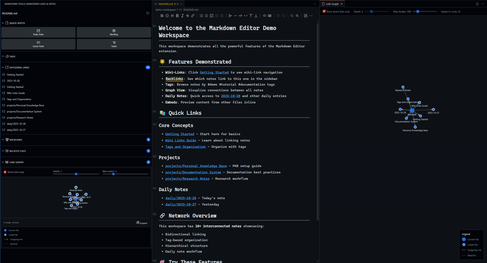
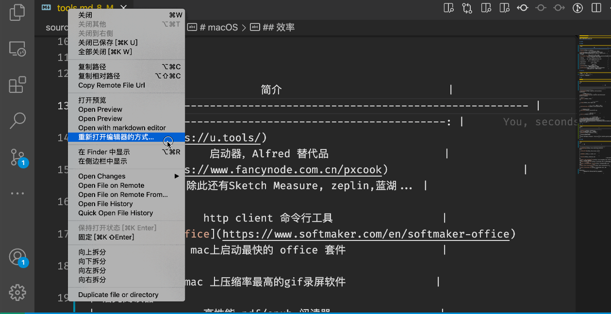

# Markdown Editor — A Full-Featured WYSIWYG Editor for VS Code

[](https://marketplace.visualstudio.com/items?itemName=phfsantos.markdown-editor)
[](https://marketplace.visualstudio.com/items?itemName=phfsantos.markdown-editor)
[](https://marketplace.visualstudio.com/items?itemName=phfsantos.markdown-editor)

A powerful markdown editor combining **WYSIWYG editing** with **Obsidian-style knowledge management**. Features include wiki-links, interactive graph views, backlinks, tag management, and advanced markdown tooling—all within VS Code.

## 📸 Screenshots

### Obsidian-Style Knowledge Management



*Complete workspace view featuring: WYSIWYG editor (center), dedicated sidebar panel (left) with templates, tags, embeds, outgoing links, backlinks, related files, and interactive graph visualization (right) showing note connections and relationships.*

### WYSIWYG Editing Experience



*Real-time rendering, multiple editing modes, and seamless VS Code integration*

> **Note for Marketplace**: Please save the screenshot from your workspace and place it at `./media/screenshot-main.png` before publishing. The screenshot should show the complete interface with sidebar panel and graph view visible.

## ✨ Key Features

### WYSIWYG Editing

- **What You See Is What You Get** — Real-time rendering as you type
- **Multiple Editing Modes**: Instant Rendering (Recommended) / WYSIWYG / Split Screen
- **Auto-sync** between VS Code editor and webview
- **Multi-theme Support** — Adapts to your VS Code theme

### 🔗 Obsidian-Style Knowledge Management

- **Wiki-Link Support**: Use `[[filename]]` syntax with intelligent autocomplete and fuzzy matching
- **Dedicated Sidebar Panel** with real-time updates:
  - 📊 **Interactive Graph View** — Visualize note connections with adjustable depth and node limits
  - 🔍 **Quick Note Templates** — Daily notes, meeting notes, quick notes, and task lists
  - 🏷️ **Tag Management** — Browse workspace tags and filter files by tag
  - 📎 **Embed Previews** — Inline preview of images and embedded files
  - ↩️ **Backlinks** — See which notes link to the current file with context
  - 🔗 **Outgoing Links** — View all links in the current file with resolution status
  - 🎯 **Related Files** — Smart recommendations based on proximity, backlinks, and content similarity
- **Daily Notes**: Quick command to create/open today's note with customizable folder
- **Performance Optimized**: Incremental loading with caching for large workspaces (1000+ files)

### 🛠️ Advanced Markdown Tools

- **Real-time Diagnostics**: Live validation and error detection with inline warnings
- **CodeLens**: Inline statistics for headings, images, and tables
- **Opt-In AI Auto-Complete**: Ghost-text suggestions stay off by default and can be enabled from settings or the Status sidebar panel
- **Powerful Commands**:
  - Show Heading Statistics
  - Add Alt Text to Images
  - Format Tables
  - Insert Table of Contents
  - Validate Document Structure
  - Open Full-Screen Graph View
  - Quick Open Note (Fuzzy Search)
  - Open Daily Note
  - Rebuild Relationship Cache
  - Filter Notes by Tag

### 📝 Rich Markdown Support

- **Image Handling**: Upload/paste/drag-drop with auto-save to configurable folder
- **Copy**: Export as markdown or HTML
- **Markdown Extensions** via [vditor](https://github.com/Vanessa219/vditor)
- **Rich Diagrams**: KaTeX, Mermaid, Graphviz, ECharts, abc.js (music notation)
- **Custom CSS**: Personalize layout and styling

### ⚡ Performance & Caching

- **Smart Optimization**: Auto-detects workspace size and optimizes accordingly
- **Intelligent Caching**: 10-minute cache with automatic invalidation on file changes
- **Cache Management**: Visual cache status in sidebar with one-click rebuild
- **Incremental Loading**: Sidebar sections load progressively for instant feedback
- **Configurable Performance Modes**: Auto / Performance / Compatibility
- **Large Workspace Support**: Tested with 1000+ markdown files
- **Parallel Processing**: Backlinks, outgoing links, and related files computed simultaneously

## Install

[https://marketplace.visualstudio.com/items?itemName=phfsantos.markdown-editor](https://marketplace.visualstudio.com/items?itemName=phfsantos.markdown-editor)

## Supported syntax

[demo article](https://ld246.com/guide/markdown)

## Usage

### 1. Command mode in markdown file

- open a markdown file
- type `cmd-shift-p` to enter command mode
- type `markdown-editor: Open with markdown editor`

### 2. Key bindings

- open a markdown file
- type `ctrl+shift+alt+m` for win or `cmd+shift+alt+m` for mac

### 3. Explorer Context menu

- right click on markdown file
- then click `Open with markdown editor`

### 4. Editor title context menu

- right click on a opened markdown file's tab title
- then click `Open with markdown editor`

### Custom CSS (custom layout and vditor personalization)

Edit your settings.json and add:

```json
{
  "markdown-editor.customCss": "my custom css rules"
```

**Example:**

```json
span
```

## ⚙️ Configuration

The extension provides many settings to customize your experience:

### Editor Settings

```json
{
  // Image save folder (relative to markdown file or use ${projectRoot}/assets for workspace root)
  "markdown-editor.imageSaveFolder": "assets",
  
  // Use VS Code theme colors in the editor
  "markdown-editor.useVscodeThemeColor": true,
  
  // Custom CSS rules for editor styling
  "markdown-editor.customCss": ""
}
```

### Feature Toggles

```json
{
  // Enable real-time diagnostics and error detection
  "markdown-editor.enableDiagnostics": true,
  
  // Show CodeLens for headings, images, and tables
  "markdown-editor.enableCodeLens": true,
  
  // Apply visual decorations to markdown elements
  "markdown-editor.enableDecorations": true,
  
  // Enable #tag support in sidebar
  "markdown-editor.enableTagSupport": true,
  
  // Enable debug logging (useful for troubleshooting)
  "markdown-editor.enableDebugLogging": false
}
```

### AI Settings

```json
{
  // Enable AI workflows for .agent.md, .prompt.md, and SKILL.md files
  "markdown-editor.ai.enable": true,

  // Opt in to AI auto-complete suggestions in both editors
  "markdown-editor.ai.enableInlineSuggestions": false,

  // Show AI badges and actions inside the custom editor
  "markdown-editor.ai.enableAffordances": true,

  // Allow AI workflows to hand context off to chat surfaces
  "markdown-editor.ai.enableChatInterop": true
}
```

You can also toggle `markdown-editor.ai.enableInlineSuggestions` from the Status view in the Markdown Tools sidebar. The status panel includes a one-click entry and title-bar button so the feature can stay opt-in without digging through settings.

### Performance Settings

```json
{
  // Performance mode: "auto", "performance", or "compatibility"
  "markdown-editor.performanceMode": "auto"
}
```

### Knowledge Management & Performance

```json
{
  // Folder for daily notes (relative to workspace root)
  "markdown-editor.dailyNotesFolder": "daily",
  
  // Enable #tag support and parsing
  "markdown-editor.enableTagSupport": true,
  
  // Maximum file sizes for embed previews
  "markdown-editor.previewEmbedSizeLimit": 5242880,      // 5 MB (generic files)
  "markdown-editor.previewEmbedImageLimit": 8388608,     // 8 MB (images)
  "markdown-editor.previewEmbedTextLimit": 204800        // 200 KB (text files)
}
```

### Commands

Access these commands via Command Palette (`Ctrl+Shift+P` or `Cmd+Shift+P`):

- `Markdown Editor: Open with markdown editor` - Open file in WYSIWYG editor
- `Markdown Editor: Set as Default Markdown Editor` - Make this the default for .md files
- `Markdown Editor: Open Link Graph View` - Open full-screen interactive graph
- `Markdown Editor: Quick Open Note (Fuzzy)` - Fuzzy search all markdown files
- `Markdown Editor: Open Daily Note` - Create/open today's daily note
- `Markdown Editor: Rebuild Relationship Cache` - Manually rebuild link/tag cache
- `Markdown Editor: AI: Toggle Auto-Complete Suggestions` - Enable or disable opt-in AI ghost text
- `Markdown Editor: Show Heading Statistics` - Analyze document structure
- `Markdown Editor: Validate Document Structure` - Check for markdown issues
- `Markdown Editor: Format Table` - Auto-format markdown table
- `Markdown Editor: Insert Table of Contents` - Generate TOC from headings

## 🔧 Troubleshooting

### Enable Debug Logging

If you encounter issues, enable debug logging to see detailed information:

1. Open Settings (JSON): `Ctrl+Shift+P` → "Preferences: Open Settings (JSON)"
2. Add: `"markdown-editor.enableDebugLogging": true`
3. Open the Output panel: View → Output
4. Select "Markdown Editor" from the dropdown
5. Reproduce the issue and check the logs

### Performance with Large Workspaces

For workspaces with many markdown files (500+):

1. Set performance mode to "performance": `"markdown-editor.performanceMode": "performance"`
2. Consider disabling features you don't use:

  ```json
   {
     "markdown-editor.enableDiagnostics": false,
     "markdown-editor.enableCodeLens": false
   }
   ```

### Wiki-Links Not Working

Ensure you're using the correct syntax:

- `[[filename]]` — Links to filename.md
- `[[folder/filename]]` — Links to file in subfolder
- File extensions are optional

## 📚 Supported Syntax

For complete markdown syntax guide, see: [demo article](https://ld246.com/guide/markdown)

## 🎉 What's New in 0.4.7

See [CHANGELOG.md](./CHANGELOG.md) for detailed release notes.

### Latest Features

- 🚀 **Performance Overhaul**: Incremental sidebar loading with visual loading states
- 💾 **Smart Caching**: 10-minute cache with intelligent invalidation and manual rebuild
- 📊 **Cache Status Display**: Real-time cache monitoring in sidebar header
- 🎯 **Enhanced Graph View**: Adjustable depth, max nodes, and node distance controls
- 📎 **Embed Support**: Preview images and files directly in sidebar
- 🔗 **Related Files**: Smart file recommendations based on multiple factors
- ⚡ **Instant UI**: Progressive loading ensures responsive experience on large workspaces
- 🏷️ **Tag Management**: Browse all workspace tags with file counts
- 🔄 **Real-time Updates**: Sidebar updates automatically on file changes
- ✨ **Polish**: Improved UI, better error handling, and optimized rendering

### Previous Highlights (0.4.2)

- 🆕 Obsidian-style sidebar with interactive graph view
- 🆕 Wiki-link support with intelligent autocomplete
- 🆕 Daily notes functionality with customizable templates
- 🆕 Enhanced diagnostics and CodeLens
- ✨ Production-ready logging system
- 🔒 Security audit clean (0 vulnerabilities)
- ✅ Comprehensive test coverage

## �🙏 Acknowledgement

- [vscode](https://github.com/microsoft/vscode)
- [vditor](https://github.com/Vanessa219/vditor)
- [phfsantos](https://github.com/phfsantos)

## 📝 Todo

- [ ]  Using [Custom Text Editor](https://code.visualstudio.com/api/extension-guides/custom-editors#custom-text-editor) ([demo](https://github.com/gera2ld/markmap-vscode))
- [ ]  Code splitting for main.js bundle size optimization
- [ ]  Multi-root workspace support

## License

MIT

## Support

If you like this extension make sure to star the repo. I am always looking for new ideas and feedback. In addition, it is possible to [donate via paypal](https://www.paypal.me/phfsantos).
