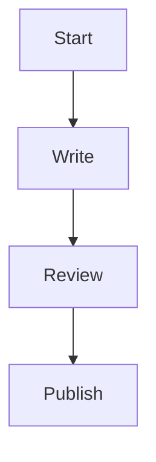

# Documentation System

Best practices for creating and maintaining documentation using this extension.

## Documentation Philosophy

Good documentation is:
- ✅ **Discoverable**: Easy to find
- ✅ **Understandable**: Clear and concise
- ✅ **Maintainable**: Easy to update
- ✅ **Interconnected**: Linked to related docs

## Documentation Types

### 1. Guides and Tutorials
Step-by-step instructions for newcomers.

Examples:
- [[Getting Started]]
- [[Wiki Links Guide]]
- [[Tags and Organization]]

### 2. Reference Documentation
Technical details and API docs.

Link to: [[projects/Research Notes]]

### 3. Concept Explanations
Deep dives into key concepts.

Example: [[projects/Personal Knowledge Base]]

### 4. Decision Records
Why certain choices were made.

Use tags: #decision #architecture

## Documentation Structure

### Index Page
Start with a clear index: [[README]]

### Hierarchical Organization
```
docs/
├── getting-started/
├── guides/
├── reference/
└── concepts/
```

### Cross-Linking
Every page should link to:
- Parent topic
- Related topics  
- Next steps

Example:
- Parent: [[README]]
- Related: [[Wiki Links Guide]], [[Tags and Organization]]
- Next: [[projects/Personal Knowledge Base]]

## Writing Tips

### Use Clear Headings
```markdown
# Main Title
## Section
### Subsection
```

### Add Examples
Show, don't just tell:
```markdown
Example: [[Getting Started]]
```

### Include Diagrams
Use Mermaid for flowcharts:



### Tag Appropriately
Add relevant tags: #documentation #tutorial #guide

## Documentation Workflow

### 1. Plan
- Identify audience
- Define scope
- Outline structure

### 2. Write
- Start with overview
- Add details progressively
- Link to related content

### 3. Review
- Check accuracy
- Test examples
- Verify links

### 4. Publish
- Update index
- Announce changes
- Archive old versions

### 5. Maintain
- Regular reviews
- Update for changes
- Deprecate outdated content

## Tools for Documentation

### Sidebar Features
- See backlinks to track references
- Browse tags for categorization
- Navigate structure easily

### Graph View
- Visualize doc relationships
- Find orphaned pages
- Identify documentation gaps

### Quick Open
- Fast navigation
- Fuzzy search

## Documentation Metrics

Track:
- Coverage (topics documented)
- Freshness (last updated)
- Connectivity (link density)
- Usage (backlink count)

## Example Documentation Sets

In this workspace:
- Core guides: [[Getting Started]], [[Wiki Links Guide]], [[Tags and Organization]]
- Project docs: [[projects/Personal Knowledge Base]], [[projects/Research Notes]]
- Daily logs: [[daily/2025-10-28]], [[daily/2025-10-27]]

## Related

- [[Getting Started]] - Basics
- [[projects/Personal Knowledge Base]] - PKB approach
- [[projects/Research Notes]] - Research workflow
- [[README]] - Workspace overview

---

#documentation #writing #tutorial #best-practices #technical-writing
