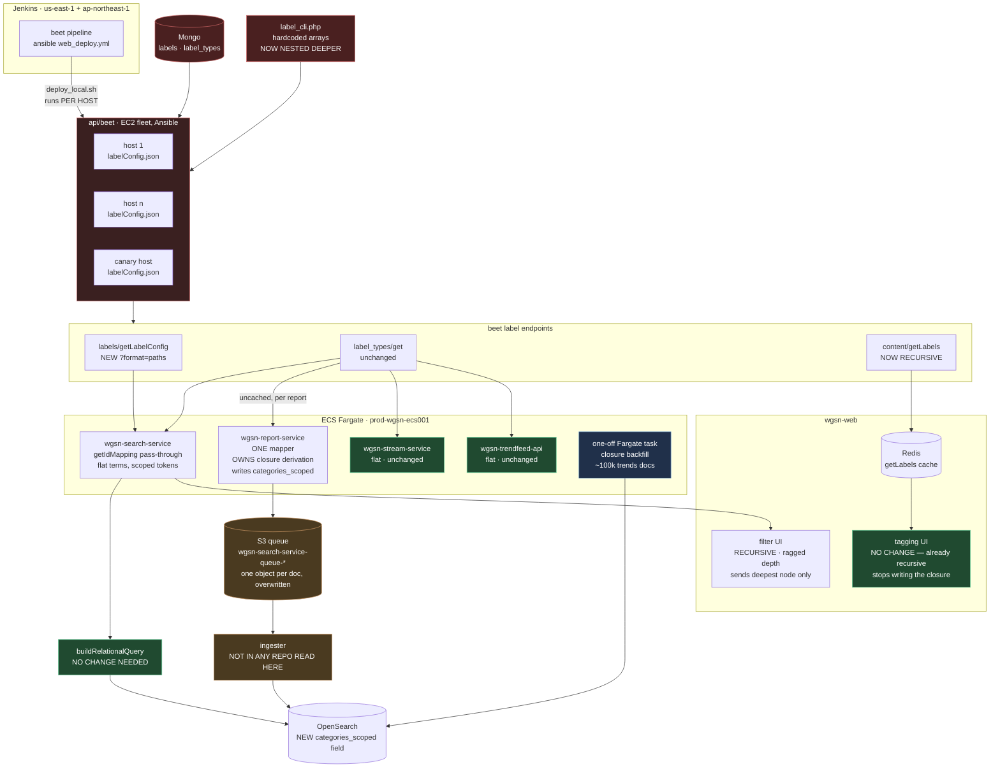
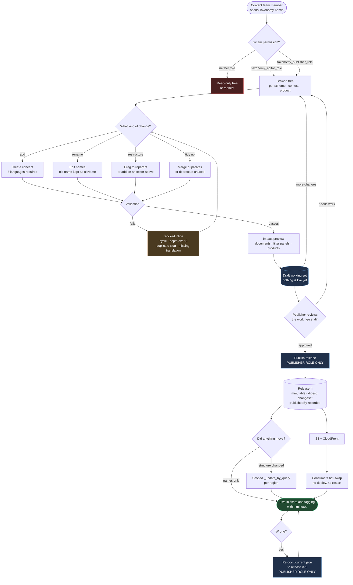
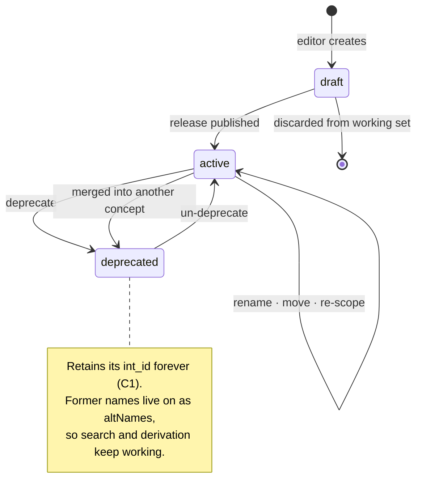

# 12 — Target Architecture on AWS, and the Editorial Workflow

Deployment-level diagrams for the agreed route: [Proposal A](04-proposal-a-third-level-in-place.md)
as Phase 0, then [Proposal B](05-proposal-b-snapshot-service.md), built with the decisions recorded
in [11](11-open-questions.md).

Everything here is drawn against the AWS estate that **actually exists**, read from the deploy
pipelines rather than assumed. §1 separates what is verified from what is proposed, because the two
should not be read with equal confidence.

## 1. Proposal A, in place

Nothing moves. The taxonomy still lives in PHP arrays on an EC2 fleet; the depth ceiling is lifted
and the closure becomes a property of the index rather than a side effect of a React component.



Green = already correct, no work. Blue = new. Red = the problem Phase 0 deliberately leaves alone.

Two things to read off this diagram. The **red is still most of the left-hand side** — Phase 0 buys
depth and correctness, not ownership, which is why it is time-boxed against B. And the **backfill is
per region**: if each region has its own OpenSearch domain, the one-off task runs twice, and so does
every subsequent scoped update.

## 2. End state — Proposal B on AWS

```mermaid
flowchart TB
    subgraph EDIT["Editorial · content team"]
        ED["Editor<br/>taxonomy_editor_role"]
        PUB["Publisher<br/>taxonomy_publisher_role"]
    end

    subgraph USE1["us-east-1 · authoring + primary read"]
        UI["Taxonomy Admin UI<br/>tree · drag-to-reparent<br/>working-set diff"]
        ALB["ALB"]
        subgraph TXS["ECS Fargate · prod-wgsn-ecs001"]
            API["prod-wgsn-taxonomy-service-svc-fargate<br/>authoring + read API<br/>validation · impact · releases"]
            RELB["release builder<br/>materialise paths + closure"]
            RX["reindex orchestrator<br/>one-off Fargate task"]
        end
        PG[("RDS PostgreSQL · Multi-AZ<br/>concepts · relations · schemes<br/>contexts · scoping · releases")]
        SM
```

### What is new versus reused


| Piece                        | Build or reuse                                                                                                                                                                      |
| ---------------------------- | ----------------------------------------------------------------------------------------------------------------------------------------------------------------------------------- |
| `wgsn-taxonomy-service`      | **New repo** (Q8), but a **known deployment shape** — ECR image, `prod-wgsn-taxonomy-service-svc-fargate` on the existing cluster, existing Jenkins template                       |
| RDS PostgreSQL               | New instance,**established pattern** — `pg` + TypeORM and the `DB_*` convention from wgsn-trends-api                                                                               |
| Snapshot bucket + CloudFront | New bucket.**search-service already reads S3 with `aws-sdk`**, so the consumer side is an existing code path, not a new capability                                                  |
| EventBridge                  | New. Optional — polling`current.json` achieves F18 without it                                                                                                                      |
| Reindex orchestrator         | New. Fargate one-off task rather than Lambda, to avoid the 15-minute ceiling on a 100k-document pass                                                                                |
| Admin UI                     | Reuse: wgsn-web session,`userHasPermission`, MUI 6, and the `LabelTree` prototype from branch `WGSN-12269`. Build: the draft/working-set/publish workflow the prototype has none of |
| Permissions                  | Reuse wham entirely — two new permission names, no new mechanism                                                                                                                   |
| `buildRelationalQuery`       | **Untouched, in every phase**                                                                                                                                                       |

## 3. The editorial workflow

The user-facing payoff, with the two permission tiers from
[Q5](11-open-questions.md#q5--the-role-model-and-where-it-plugs-in). The release is the approval
gate — there is no per-change review queue.



### Concept lifecycle

Deletion is not in it. Nothing is ever destroyed, which is what makes
[P7](02-problem-inventory.md#p7--no-audit-versioning-or-rollback--high) go away.



### What a rename costs

The whole point, stated as a before and after.


|                            | Today                                                              | End state                                           |
| -------------------------- | ------------------------------------------------------------------ | --------------------------------------------------- |
| Who can do it              | An engineer                                                        | A content-team editor                               |
| Steps                      | Edit PHP, hand-run a Mongo script, deploy beet, restart 3 services | Type a new name, publish                            |
| Propagation                | Full beet deploy +`force-new-deployment` × 3                      | Under a minute, no deploy                           |
| Consistency during rollout | Hosts and tasks serve**different** taxonomies                      | One version, pinnable per request                   |
| Audit                      | A line in a deploy log                                             | `changeset` + `publishedBy` on an immutable release |
| Undo                       | Write an inverse script by hand                                    | Re-point`current.json`                              |
| Old name keeps working     | No — silent breakage                                              | Yes — retained as an`altName`                      |

## 4. How the reindex works

Two properties of the index decide everything here, and both are verified from source.

**Labels are indexed as ids only — no names:**

```ts
// mapV3ReportToSearchableReport.ts:178 and five sibling mappers
[type]: labels.map((l) => ({ external_system_id: l.id })),
```

queried with a plain `term` filter on `categories.external_system_id`
([querybuilder.js:228](../../wgsn-search-service/helpers/querybuilder.js#L228)) — a flattened object
field, not `nested`. Names are hydrated at query time from the label config.

**So a rename never needs a reindex.** Renames, translations, `altNames` and product re-scoping never
touch the index, which is most of what editorial does day to day. What *does* go stale is the
**closure** — derived from the editor's tags plus the shape of the tree at derivation time. Change
the shape and the derived value is wrong. That is the only reason a reindex exists.


| Editorial change                                             | Reindex needed                               |
| ------------------------------------------------------------ | -------------------------------------------- |
| Rename, translate, add`altName`                              | **None**                                     |
| Add a new leaf concept                                       | **None** — no document carries it yet       |
| **Add an ancestor above existing concepts** — the Q4 change | Additive pass over the subtree               |
| Move a concept to a new parent                               | Re-derive`categories_scoped` for the subtree |
| Merge duplicates                                             | Additive                                     |
| Deprecate                                                    | None — documents keep the id                |

### 4.1 The write path is indirect

report-service does not write to OpenSearch. It uploads the mapped document to an S3 bucket
([UploadReportToS3.service.ts](../../wgsn-report-service/src/services/UploadReportToS3.service.ts)):

```ts
const bucket   = env.S3_REPORT_QUEUE;                             // 'wgsn-search-service-queue-dev'
const fileName = `${searchableReport.type}-${searchableReport.id}.json`;
```

One object per document, fixed key, overwritten each time. **The ingester that moves those objects
into OpenSearch is in none of the repos checked out here.** That single unknown decides which
mechanism below is safe, which is why it leads §5.

### 4.2 Two mechanisms, not equivalent

**(a) Replay through the mapper.** `ReindexReport`
([ReindexReport.service.ts](../../wgsn-report-service/src/services/ReindexReport.service.ts)) already
exists and is reachable over HTTP with `{publicId, lang}`. It re-reads the published report from
Mongo, re-runs the mapper for that report type, and re-uploads to S3. Canonical — one implementation
of the derivation, and S3 and the index stay in agreement.

Its cost is the problem at scale: `execute()` calls `getLabelsData()` **per report, uncached**, so
replaying *n* documents means *n* full fetches of ~1,700 labels x 8 languages from beet. That makes
[P10](02-problem-inventory.md#p10--two-opposite-caching-failure-modes--medium) a **prerequisite**, not
an optimisation. Reassuringly there are no hidden side effects — the params accept `emails`,
`atomicStream` and `pdfService` flags, but `execute()` only re-maps and uploads.

**(b) `_update_by_query` in place.** Narrow and fast, with no load on Mongo or beet:

```
POST trends/_update_by_query?conflicts=proceed&slices=auto&wait_for_completion=false&requests_per_second=2000
{
  "query":  { "terms": { "categories.external_system_id": [101,201,202,301,302] } },
  "script": { "lang": "painless", "params": { "add": "4822:41800" },
              "source": "if (!ctx._source.categories_scoped.contains(params.add)) { ctx._source.categories_scoped.add(params.add); }" }
}
```

Returns a task id; poll `GET _tasks/{id}`. `conflicts=proceed` because report-service may be writing
the same documents concurrently.

**Its risk is the S3 bypass.** If that bucket is a durable mirror rather than a transient queue, a
later replay of an untouched object silently reverts the update. The naming and the
one-overwritten-key-per-document layout suggest transient, but it is not verified.

**Recommendation:** use (b) for the Phase 0 backfill and for scoped subtree updates **if** the bucket
is transient; otherwise (a), with the label fetch cached first. Either way keep the canonical
derivation in the mapper, so painless is only ever doing a narrow mechanical update and there is one
definition of "the closure" rather than two.

### 4.3 Why a separate field, and why the token is product-qualified

The affected set comes from the release `changeset`: for each moved concept, expand its subtree and
select documents carrying any of those ids. Bounded and computable — never a full-index pass after
the initial backfill.

Additive updates are idempotent; **removals are not**, if the closure shares a field with the
editor's own choices. Moving `Outerwear` out from under `Apparel` should strip `Apparel` from those
documents, but you cannot tell whether a document holds `Apparel` from the old path or from a direct
editorial choice — that intent is already lost
([11 §3.1](11-open-questions.md#31-the-tagging-ui-already-writes-the-ancestor-closure)).

With the closure in its own field, reindex is a **pure recomputation** — for each product the
document belongs to, the union of the paths of every id in `external_system_id`, emitted as
`"<productId>:<conceptId>"` tokens — safe to re-run, safe to rebuild from zero.

Two things follow for the re-derivation job. It must be **product-aware**: a document can belong to
several products (`products.wham_product_id` is multi-valued) and category trees differ per product,
so the closure is computed once per product and the tokens qualified accordingly
([09 §4.2](09-depth-and-query-expansion.md#42-the-encoding-product-qualified-closure-tokens)). And a
scoped update must be **keyed on the right token set** — moving a concept in Fashion changes
`4822:*` tokens only, leaving the same concept's `4823:*` tokens untouched, which makes the affected
set smaller than an unscoped design would.

This is the argument that moved the field from Phase 3 to Phase 0; the reasoning is in
[09 §4.1](09-depth-and-query-expansion.md#41-why-the-closure-needs-its-own-field).

### 4.4 Sequencing and operations

**Reindex before flipping the pointer.** Build release *n*, run the scoped update against it, *then*
publish `current.json`. Immutable releases make this ordering possible, and it avoids a window where
the filter UI offers a node that returns nothing.

- **Runs as a one-off Fargate task** on the existing cluster — not Lambda, whose 15-minute ceiling a
  100k-document pass can approach.
- **Once per region**, if each region has its own OpenSearch domain. Applies to the Phase 0 backfill
  and to every scoped update after it.
- **Throttled** with `requests_per_second` so a backfill does not disturb live search.
- **Verification** is the same query that sizes the bug beforehand: how many documents carry a child
  category without its parent. Run it before and after; it should go to zero and stay there.
- **Scale** — ~100k trends documents is minutes, not hours.

## 5. What to confirm before building this

1. **Is the `S3_REPORT_QUEUE` bucket transient or durable?** Decides whether an in-place
   `_update_by_query` is safe or gets silently reverted by a later replay (§4.2). The ingester is in
   none of the repos read here, so this is the first thing to establish.
2. **One OpenSearch domain per region?** Drives whether the Phase 0 backfill and every scoped
   reindex run once or twice.
3. **RDS sizing and ownership** with the platform team. The dataset is ~1,700 concepts — trivial —
   but Multi-AZ, backup policy and who is on call are not technical questions.
4. **Admin UI location** — `apps/` in wgsn-web per §2, or served by the service.
5. **Whether `deploy_global.sh` can generate `labelConfig.json` once per deploy** as a Phase 0
   freebie. It removes host-level divergence for near-zero effort, and it is already the hook.
6. **Descendant over-tagging** ([11 §3.1](11-open-questions.md#31-the-tagging-ui-already-writes-the-ancestor-closure))
   — still the one product decision outstanding, and it must land before the backfill runs.
