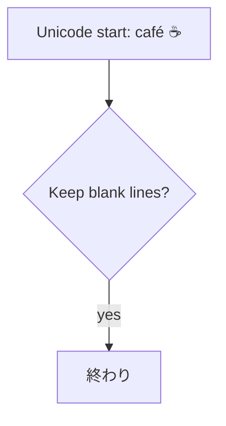

# Custom block save fixture

Before the custom blocks.



Between the custom blocks.

```kanban-board
<!-- board: fixture-board -->
<!-- file: assets/fixture-board.json -->
```

```table
<!-- table: fixture-table -->
<!-- file: assets/fixture-table.json -->
```

After the custom blocks.
